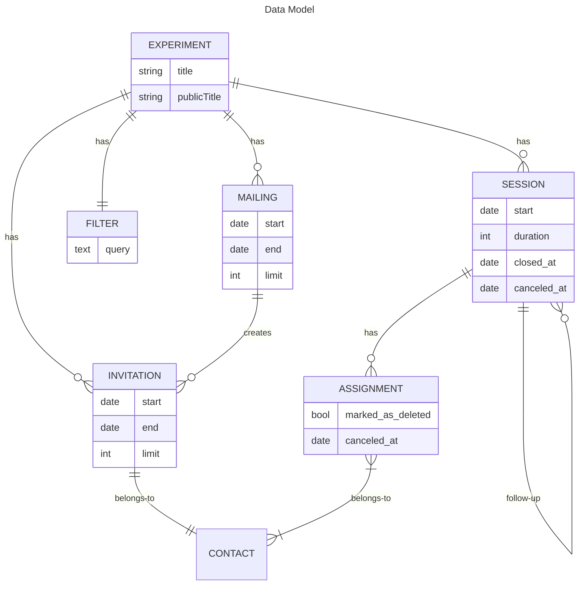

# Data Model

## Experiment

The experiment is the entrypoint.

## Filter

The filter contains of all the conditions that have to be met by a contact to be invited to an experiment. Conditions can consist of custom fields or information about past participations.

## Mailing

A mailing is a time window when invitations to contacts meeting defined criteria are sent out. A limit of sent invitations can be defined.

## Invitation

An invitation enables a contact to access public experiment information and enroll in sessions or the waiting list.

## Session

A session is the time and place at which an experiment is carried out. Follow-up sessions can only be attended if you have already participated in the previous session.

## Assignment

An assignment is the linking of a session to a contact.